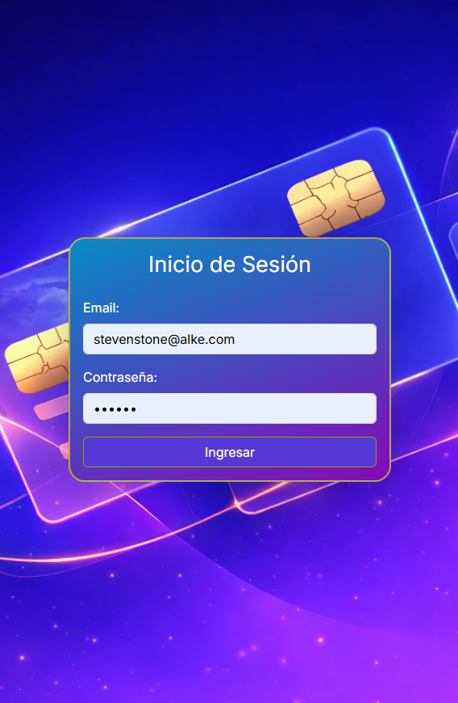
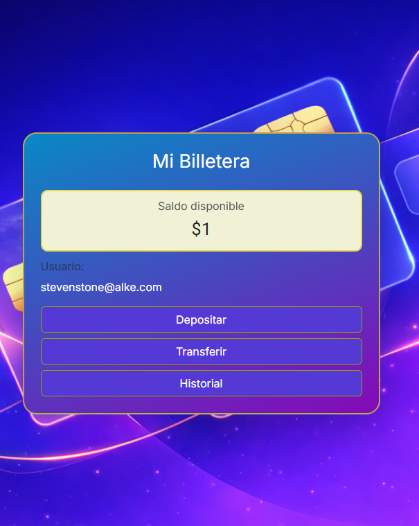
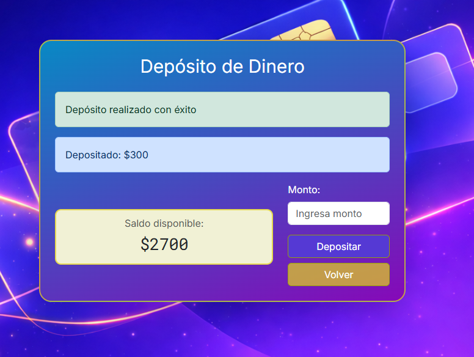
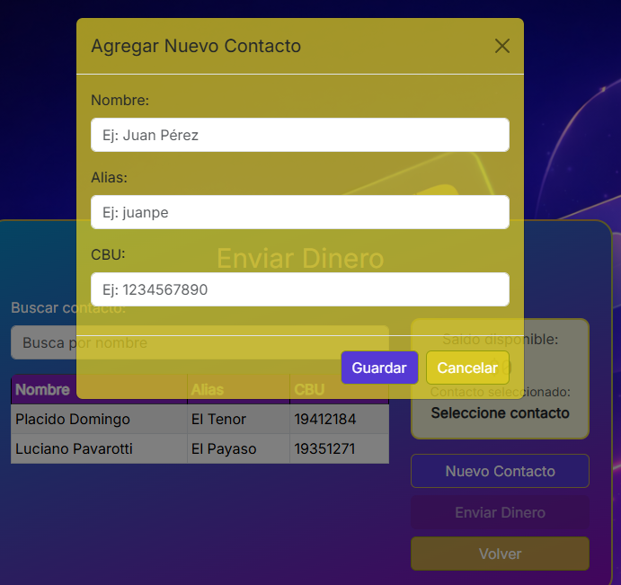
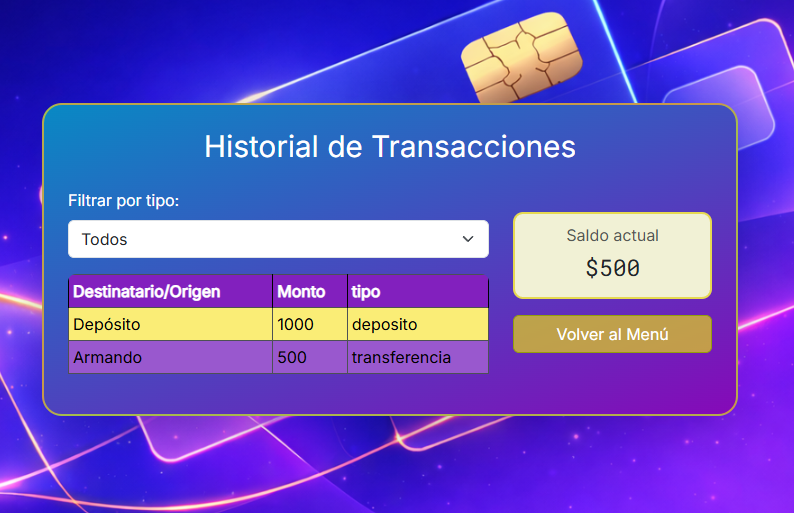

# alke-wallet
Billetera electronica

Permite:
    - Ingresar con tu usuario de cliente.
    - Consultar tu saldo en cuenta.
    - Gestionar depositos en tu cuenta.
    - Realizar transferencias.
    - Ver tu Historial de moviminetos.
Datos de usuario:
=========================================
USUARIO_VALIDO = "stevenstone@alke.com"
CONTRASENA_VALIDA = "qwerty"
=========================================
Realizado con: 
    -HTML5
    -CSS3
    -JavaScript
    -Jquery
    -Bootstrap 5
Instalacion:
    -Mediante Gihub: https://github.com/Rhenn2298/alke-wallet.
    -clonar repositorio.
    -abrir mediante git en tu dispositivo.
Contiene:
    /css/ 1 archivo de estilos.
    /html/ 6 archivos de navegacion.
    /js/ 3 archivos de scripts
    /img/ 1 fondo de pantalla
Pantallas:
Login:

Menu:

Depositos:

Transferencias:

Historial:

